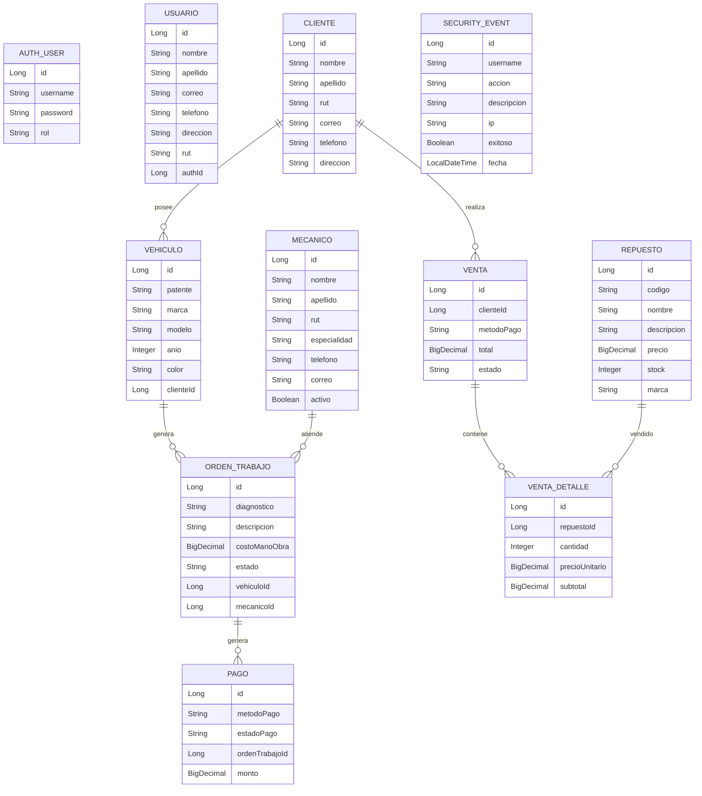

# DER general sugerido

Este DER es una representación lógica general. Cada microservicio mantiene su propia base de datos independiente, por lo que las relaciones entre servicios se manejan mediante IDs y llamadas HTTP, no mediante claves foráneas entre bases distintas.

